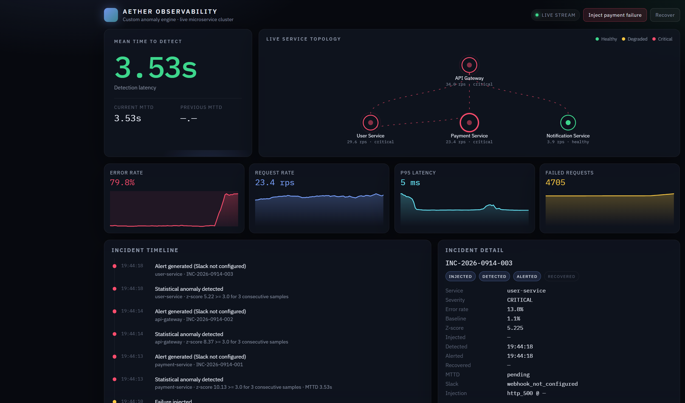

# Aether — Real-Time Microservice Observability Platform

A locally runnable observability stack: **Dockerized microservices → Prometheus → custom rolling z-score anomaly engine → Slack → live WebSocket dashboard**.

This is a mini Datadog/Grafana-style product with a **custom incident detection layer**. Grafana alert rules are not used. Every chart value comes from Prometheus via the anomaly engine — nothing on the dashboard is fake.

## 1. Architecture

```text
                    ┌──────────────────┐
                    │  Load generator  │
                    └────────┬─────────┘
                             ▼
                    ┌──────────────────┐
                    │   API Gateway    │
                    └───────┬──────────┘
              ┌─────────────┼─────────────┐
              ▼             ▼             ▼
        User Service  Payment Service  Notification
              │             ▲
              └─────────────┘
                             │  /metrics (Prometheus)
                             ▼
                    ┌──────────────┐
                    │  Prometheus  │
                    └──────┬───────┘
                           ▼
                  ┌──────────────────┐
                  │ Custom Anomaly   │
                  │ Detection Engine │
                  └──────┬───────────┘
                         ├──────── Slack webhook
                         ▼
                    WebSocket / REST
                         ▼
                  Observability UI :3000
```

Request path for checkout:

`API Gateway /api/checkout` → `user-service` validate → `payment-service` capture → `notification-service` receipt.

## 2. Setup

Prerequisites: Docker Desktop, and Python 3.11+ if you want to run injection/benchmark from the host.

```bash
git clone <repo>
cd observability_stack
cp .env.example .env
docker compose up --build
```

Or:

```bash
make up
```

Open **http://localhost:3030**.

Wait ~20 seconds for Prometheus scrapes and detector warmup, then click **Inject payment failure** on the dashboard.

### Ports

| Service | Port | Purpose |
| --- | --- | --- |
| Dashboard | 3030 | Observability UI |
| Anomaly engine | 8080 | REST + WebSocket |
| Prometheus | 9090 | Metrics store / query |
| API Gateway | 8000 | Edge HTTP API |
| User service | 8001 | Profiles / validation |
| Payment service | 8002 | Payments |
| Notification service | 8003 | Receipts |

## 3. API endpoints

### Microservices (all four)

| Method | Path | Description |
| --- | --- | --- |
| GET | `/health` | Liveness + injection state |
| GET | `/ready` | Readiness |
| GET | `/metrics` | Prometheus metrics |
| POST | `/inject` | Start synthetic failure |
| GET | `/inject` | Injection status |
| POST | `/inject/reset` | Clear injection |

### Gateway

| Method | Path | Downstream |
| --- | --- | --- |
| GET | `/api/users` | user-service |
| GET | `/api/users/{id}` | user-service |
| GET | `/api/users/{id}/billing` | user → payment |
| POST | `/api/checkout` | user → payment → notification |
| GET | `/api/payments` | payment-service |
| POST | `/api/notify` | notification-service |

### Anomaly engine

| Method | Path | Description |
| --- | --- | --- |
| GET | `/api/snapshot` | Full dashboard snapshot |
| GET | `/api/services` | Latest per-service metrics |
| GET | `/api/incidents` | Incident list |
| GET | `/api/mttd` | Current / previous MTTD |
| GET | `/api/config` | Detector configuration |
| POST | `/api/config` | Tune detector (used by benchmark) |
| POST | `/api/inject` | Inject failure + start MTTD clock |
| WS | `/ws` | Real-time metrics, health, incidents |

## 4. Metrics exposed

Prometheus-compatible, labeled with `service`, `endpoint`, `method`, `status_code`:

| Metric | Type | Meaning |
| --- | --- | --- |
| `http_requests_total` | Counter | All HTTP requests |
| `http_request_errors_total` | Counter | Status ≥ 400 |
| `http_request_duration_seconds` | Histogram | Latency |
| `service_health` | Gauge | 1 healthy / 0.5 degraded / 0 critical |
| `failure_injection_active` | Gauge | Synthetic fault currently on |
| `http_requests_in_flight` | Gauge | In-flight requests |

Scrape interval: **1s**. TSDB retention: **6h**.

## 5. Anomaly-detection algorithm

Primary signal, per service, over a rolling Prometheus window (~8s):

```text
error_rate = failed_requests / total_requests
```

The engine keeps a rolling history of **non-incident** error-rate samples and computes:

```text
z = (x − μ) / σ
```

An anomaly is confirmed only when **all** of these hold:

1. Detector has finished warmup (`WARMUP_SAMPLES`)
2. Request volume ≥ `MIN_REQUEST_COUNT`
3. `z >= Z_SCORE_THRESHOLD` **or** a large absolute spike (≥ 15% and +12pp over baseline)
4. Condition persists for `CONSECUTIVE_BREACHES` samples
5. Not inside `ALERT_COOLDOWN`

Recovery requires `RECOVERY_OBSERVATIONS` consecutive samples back near baseline.

Incident payload:

```json
{
  "service": "payment-service",
  "metric": "error_rate",
  "value": 0.47,
  "baseline": 0.03,
  "z_score": 5.8,
  "severity": "critical",
  "status": "triggered"
}
```

`MTTD = detection_timestamp − failure_injection_timestamp`

The injection timestamp is recorded when `/api/inject` (dashboard) or `/api/injection` (CLI) is called — not guessed from the chart.

## 6. Configuration

Environment variables (see `.env.example`):

| Variable | Default | Role |
| --- | --- | --- |
| `ANOMALY_WINDOW` | 60 | Rolling baseline samples |
| `Z_SCORE_THRESHOLD` | 3.0 | Z trigger |
| `MIN_REQUEST_COUNT` | 20 | Volume guard |
| `CONSECUTIVE_BREACHES` | 3 | Persistence guard |
| `ALERT_COOLDOWN` | 30 | Seconds between alerts |
| `SLACK_WEBHOOK_URL` | empty | Incoming webhook |
| `DASHBOARD_URL` | http://localhost:3030 | Link in Slack |

Runtime tuning without restart:

```bash
curl -X POST http://localhost:8080/api/config \
  -H "Content-Type: application/json" \
  -d '{"profile":"optimized","anomaly_window":20,"z_score_threshold":2.5,"consecutive_breaches":2,"min_request_count":8}'
```

## 7. Failure injection

From the dashboard: **Inject payment failure**.

From the host:

```bash
pip install -r failure-injection/requirements.txt
python failure-injection/inject_failure.py --service payment --duration 60 --rate 0.8 --type http_500
```

```bash
make inject-failure
make recover
```

Modes: `http_500` (default), `latency`, `connection`, `dependency`.

## 8. Slack setup

1. Create a Slack Incoming Webhook for your channel.
2. Put the URL in `.env` as `SLACK_WEBHOOK_URL`.
3. Restart `anomaly-engine`.

If the URL is empty, alerts are still created and shown in the UI; Slack is skipped and logged.

Message includes service, severity, current vs baseline error rate, z-score, timestamp, incident ID, MTTD, and a dashboard link. A recovery message is sent when the error rate returns to baseline.

## 9. Dashboard

Dark-glass UI at http://localhost:3030:

- Live **MTTD** hero (timer starts on injection, freezes on detection)
- Service topology (health color + animated traffic edges)
- Error rate, request rate, p95 latency, failed-request charts (1 Hz updates over WebSocket)
- Incident timeline with pulse-in events
- Incident detail lifecycle: `INJECTED → DETECTED → ALERTED → RECOVERED`

Screenshots from a real local run after `docker compose up`:



The capture shows MTTD frozen at 3.53s after payment-service failure injection, critical topology nodes, a 79.8% error-rate spike, and the incident timeline (`INJECTED → DETECTED → ALERTED`).

## 10. Reproducible MTTD experiment

```bash
make benchmark
# or
python failure-injection/benchmark.py --duration 35 --rate 0.85
```

The script:

1. Applies **baseline** detector config, injects HTTP 500s into payment-service at 85% for 35s, records MTTD
2. Waits for recovery
3. Applies **optimized** config (smaller window, fewer consecutive breaches, lower volume floor), repeats the same fault
4. Writes `benchmark-results.json`

Do not edit the table below by hand — it is filled from that run.

## 11. Before vs after MTTD

| Test | Detection Configuration | MTTD |
| --- | --- | ---: |
| Baseline | window=60, z=3.0, consecutive=3, min_requests=20 | 4.489 s |
| Optimized | window=20, z=2.5, consecutive=2, min_requests=8 | 2.707 s |
| Improvement | — | 39.7% |

Source: `docs/mttd-experiment.json` from `python failure-injection/benchmark.py` on 2026-09-14. Incidents `INC-2026-0914-002` (baseline) and `INC-2026-0914-004` (optimized).

## 12. How MTTD was improved

Baseline is conservative: a longer rolling baseline, three consecutive breaches, and a higher minimum request count. That reduces false positives but waits extra sample intervals after the fault starts.

On the recorded run, that cost **4.489s MTTD**. Optimized detection cut it to **2.707s (39.7% faster)** without changing the injected fault (payment-service, HTTP 500, 85%, 35s):

- Smaller window + fewer warmup samples so μ/σ are ready sooner
- Two consecutive breaches instead of three (one less 1s tick)
- Lower `MIN_REQUEST_COUNT` so a sudden collapse in success volume still qualifies
- Slightly lower z-threshold (3.0 → 2.5) plus the absolute spike guard
- Batched Prometheus vector queries so each detector tick finishes in well under the 1s sample interval

## Makefile

```bash
make up              # docker compose up --build -d
make down
make logs
make test            # detector unit tests
make inject-failure
make benchmark
```

## Tests

```bash
pip install -r anomaly-engine/requirements.txt
cd anomaly-engine && python -m pytest -q
```

## Troubleshooting

| Symptom | What to check |
| --- | --- |
| Dashboard empty | Wait for engine + Prometheus; confirm http://localhost:8080/health |
| No traffic on graphs | `docker compose logs load-generator` |
| Injection does nothing | Hit http://localhost:8002/inject ; confirm load-generator is running |
| Anomaly never fires | Warmup needs ~12 healthy samples; wait 15s after startup before injecting |
| Slack not arriving | `SLACK_WEBHOOK_URL` must be a full `https://hooks.slack.com/...` URL |
| Port already bound | Host 3000 is often taken; this stack publishes the UI on **3030**. Stop whatever is on 8080/9090/8000-8003 if those conflict. |

## Project layout

```text
observability_stack/
├── services/            # four FastAPI microservices + shared instrumentation
├── anomaly-engine/      # z-score detector, Prometheus client, Slack, WebSocket
├── frontend/            # dark-glass React dashboard
├── failure-injection/   # CLI + MTTD benchmark
├── load-generator/      # continuous checkout/user/payment traffic
├── prometheus/
├── docker-compose.yml
└── Makefile
```
